# Nibbles — App Flow Diagrams

> **Audience:** Client-facing. Plain language. One diagram per use case.
> **Last updated:** 2026-04-09

---

## Overview — All Features & Screens

High-level map of every major screen and how they connect.

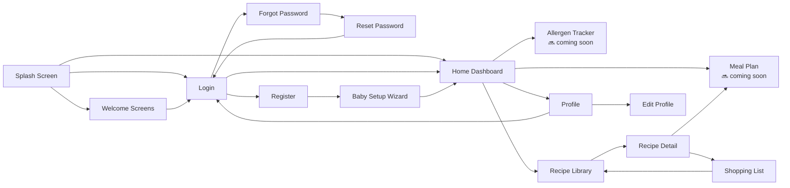

---

## 1. App Launch & Redirect Logic

Every time the app opens, it checks these conditions in order before deciding where to send the user.

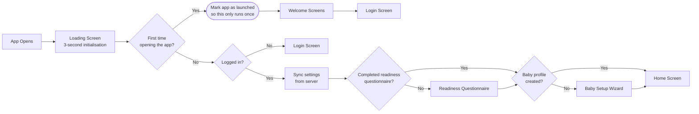

---

## 2. Onboarding — Welcome Screens

Shown only the very first time the app is opened.

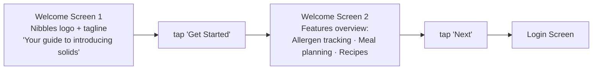

---

## 3. Onboarding — Readiness Questionnaire

A 6-question check to confirm the baby is physically ready to start solids. Only runs once.

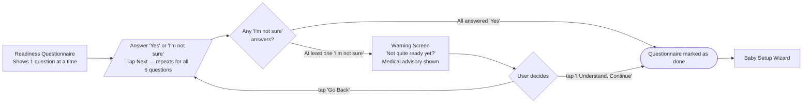

---

## 4. Onboarding — Baby Setup Wizard

3-step wizard to create the baby's profile. Runs after the readiness questionnaire, or right after creating a new account.

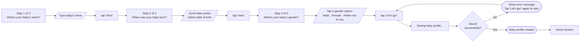

---

## 5. Auth — Register (New Account)

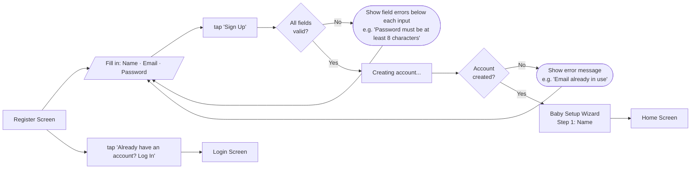

---

## 6. Auth — Login

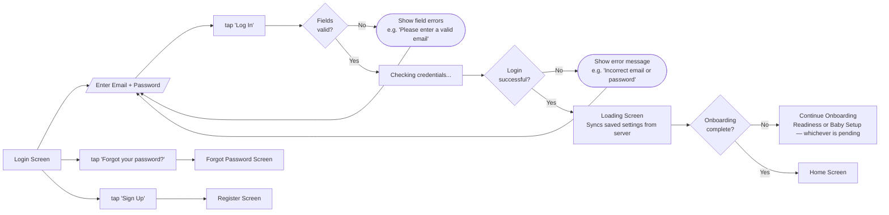

---

## 7. Auth — Forgot Password

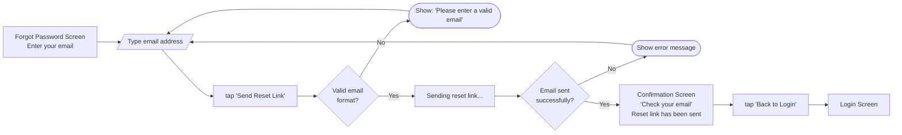

---

## 8. Auth — Reset Password (via email link)

The user taps the link in their email, which opens the app directly to this screen.

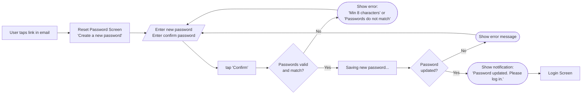

---

## 9. Main App — Tab Bar Navigation

Once onboarding is complete, the user lands in the main app. A tab bar at the bottom is always visible and lets the user switch between the 4 main sections.

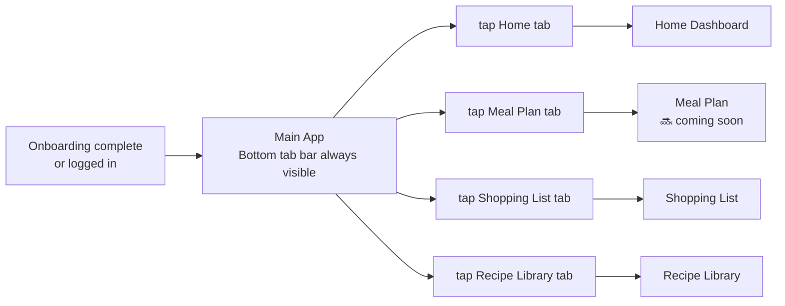

---

## 10. Home Dashboard

The main screen after login. Shows baby info, today's meal, allergen progress, and recipe picks.

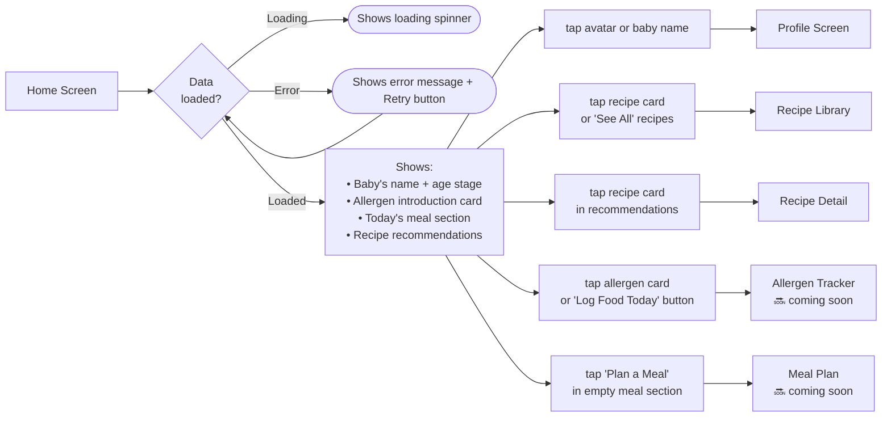

---

## 11. Profile

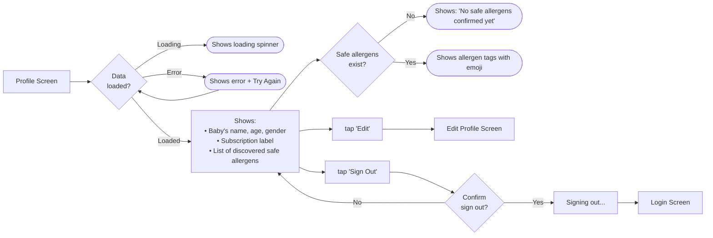

---

## 12. Edit Profile

All fields are pre-filled with the current baby profile. The user only needs to change what they want.

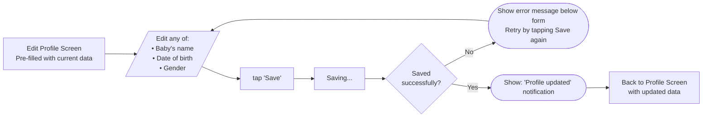

---

## 13. Recipe Library

Browse all recipes, or search by name or allergen tag.

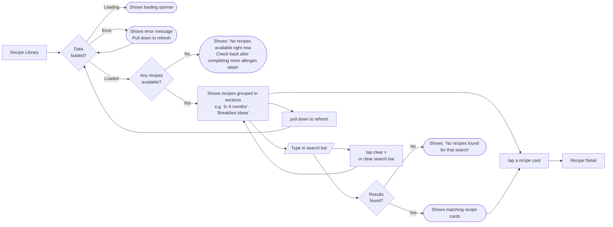

---

## 14. Recipe Detail

Full recipe view with options to add ingredients to the shopping list or assign the recipe to a meal plan date.

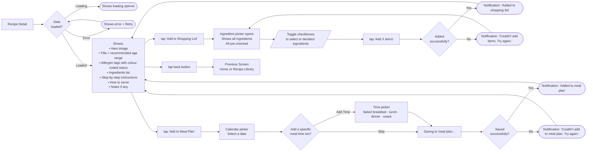

---

## 15. Shopping List

A two-tab list: **List** (items still to buy) and **Bought** (checked-off items). Items can come from recipes or be added manually.

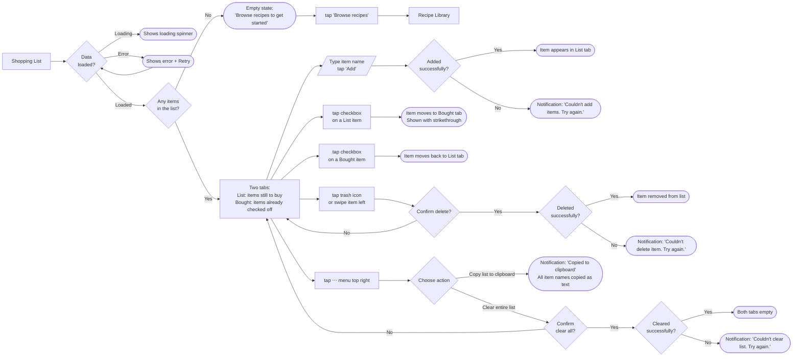

---

*Nibbles — Guided baby solids app. iOS 15+ / Android 10+.*
